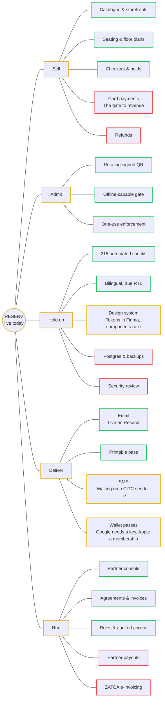

# RESERV

> [!tip] live today
> 13 of 22 pieces are shipped. 3 are moving. 6 have not been started.

## The map

## The map, as an outline

- **Sell** — What turns a room into revenue.
	- 🟢 Catalogue & storefronts
	- 🟢 Seating & floor plans
	- 🟢 Checkout & holds
	- 🔴 Card payments — *The gate to revenue*
	- 🔴 Refunds
- **Admit** — Getting the right people through the door.
	- 🟢 Rotating signed QR
	- 🟢 Offline-capable gate
	- 🟢 One-use enforcement
- **Hold up** — Whether it survives contact with the real world.
	- 🟢 215 automated checks
	- 🟢 Bilingual, true RTL
	- 🟡 Design system — *Tokens in Figma, components next*
	- 🔴 Postgres & backups
	- 🔴 Security review ⭐
- **Deliver** — Getting the ticket into someone's hand.
	- 🟢 Email ⭐ — *Live on Resend*
	- 🟢 Printable pass
	- 🟡 SMS — *Waiting on a CITC sender ID*
	- 🟡 Wallet passes — *Google needs a key, Apple a membership*
- **Run** — Everything the business side needs to operate.
	- 🟢 Partner console
	- 🟢 Agreements & invoices
	- 🟢 Roles & audited access
	- 🔴 Partner payouts
	- 🔴 ZATCA e-invoicing

⭐ = highlighted on the original map.

## Where it stands

| Area | 🟢 | 🟡 | 🔴 | |
|---|---|---|---|---|
| Sell | 3 | 0 | 2 | 🟢🟢🟢🔴🔴 |
| Admit | 3 | 0 | 0 | 🟢🟢🟢 |
| Hold up | 2 | 1 | 2 | 🟢🟢🟡🔴🔴 |
| Deliver | 2 | 2 | 0 | 🟢🟢🟡🟡 |
| Run | 3 | 0 | 2 | 🟢🟢🟢🔴🔴 |
| **Total** | **13** | **3** | **6** | |

## 🔴 Not started

| Item | Area | Note |
|---|---|---|
| Card payments | Sell | The gate to revenue |
| Refunds | Sell |  |
| Postgres & backups | Hold up |  |
| Security review ⭐ | Hold up |  |
| Partner payouts | Run |  |
| ZATCA e-invoicing | Run |  |

## 🟡 In progress

| Item | Area | Note |
|---|---|---|
| Design system | Hold up | Tokens in Figma, components next |
| SMS | Deliver | Waiting on a CITC sender ID |
| Wallet passes | Deliver | Google needs a key, Apple a membership |

## 🟢 Shipped

| Item | Area | Note |
|---|---|---|
| Catalogue & storefronts | Sell |  |
| Seating & floor plans | Sell |  |
| Checkout & holds | Sell |  |
| Rotating signed QR | Admit |  |
| Offline-capable gate | Admit |  |
| One-use enforcement | Admit |  |
| 215 automated checks | Hold up |  |
| Bilingual, true RTL | Hold up |  |
| Email ⭐ | Deliver | Live on Resend |
| Printable pass | Deliver |  |
| Partner console | Run |  |
| Agreements & invoices | Run |  |
| Roles & audited access | Run |  |

## Legend

| | Means | It is safe to say |
|---|---|---|
| 🟢 Shipped | Built, merged, and in use today. | "This works." |
| 🟡 In progress | Real work started, not finished. Usually one named blocker. | "This is moving." |
| 🔴 Not started | Nothing built yet. | "This does not exist." |

Nothing sits between colours. Half-built is 🟡; a design doc and no code is 🔴.
