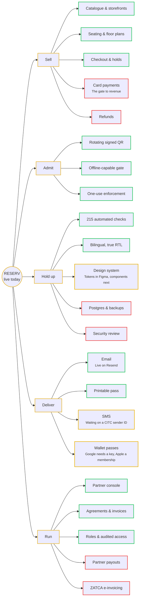

# RESERV

> [!tip] live today
> 13 of 22 pieces are shipped. 3 are moving. 6 have not been started.

**Open the map:** [[RESERV Map.canvas|RESERV Map]] — the same picture, pannable, with every node linked to its note.

## Where it stands

| Area | 🟢 | 🟡 | 🔴 | |
|---|---|---|---|---|
| [[Sell]] | 3 | 0 | 2 | 🟢🟢🟢🔴🔴 |
| [[Admit]] | 3 | 0 | 0 | 🟢🟢🟢 |
| [[Hold up]] | 2 | 1 | 2 | 🟢🟢🟡🔴🔴 |
| [[Deliver]] | 2 | 2 | 0 | 🟢🟢🟡🟡 |
| [[Run]] | 3 | 0 | 2 | 🟢🟢🟢🔴🔴 |
| **Total** | **13** | **3** | **6** | |

## The map, as text

## 🔴 Not started

| Item | Area | Note |
|---|---|---|
| [[Card payments]] | [[Sell]] | The gate to revenue |
| [[Refunds]] | [[Sell]] |  |
| [[Postgres & backups]] | [[Hold up]] |  |
| [[Security review]] | [[Hold up]] |  |
| [[Partner payouts]] | [[Run]] |  |
| [[ZATCA e-invoicing]] | [[Run]] |  |

## 🟡 In progress

| Item | Area | Note |
|---|---|---|
| [[Design system]] | [[Hold up]] | Tokens in Figma, components next |
| [[SMS]] | [[Deliver]] | Waiting on a CITC sender ID |
| [[Wallet passes]] | [[Deliver]] | Google needs a key, Apple a membership |

## 🟢 Shipped

| Item | Area | Note |
|---|---|---|
| [[Catalogue & storefronts]] | [[Sell]] |  |
| [[Seating & floor plans]] | [[Sell]] |  |
| [[Checkout & holds]] | [[Sell]] |  |
| [[Rotating signed QR]] | [[Admit]] |  |
| [[Offline-capable gate]] | [[Admit]] |  |
| [[One-use enforcement]] | [[Admit]] |  |
| [[215 automated checks]] | [[Hold up]] |  |
| [[Bilingual, true RTL]] | [[Hold up]] |  |
| [[Email]] | [[Deliver]] | Live on Resend |
| [[Printable pass]] | [[Deliver]] |  |
| [[Partner console]] | [[Run]] |  |
| [[Agreements & invoices]] | [[Run]] |  |
| [[Roles & audited access]] | [[Run]] |  |

## Areas

[[Sell]] · [[Admit]] · [[Hold up]] · [[Deliver]] · [[Run]]

See [[Status legend]] for what each colour commits to.
